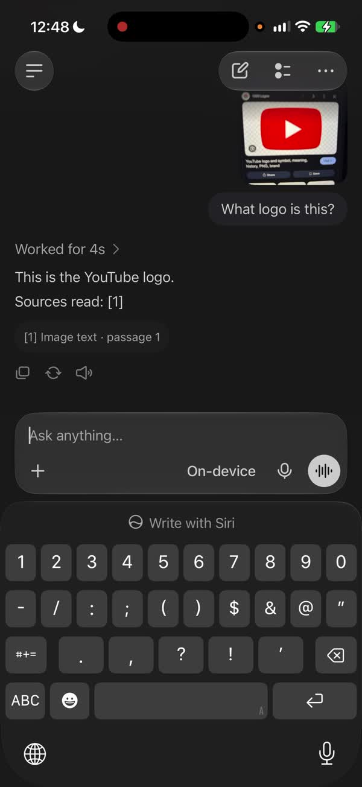
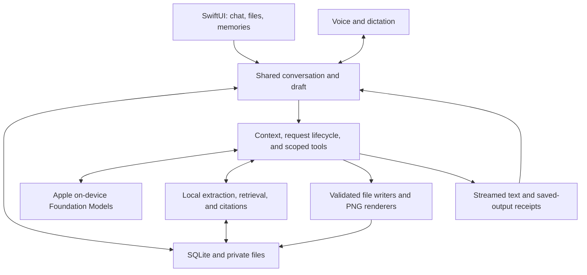

# LocalGPT

**A private AI workspace for iPhone.** Chat by text or voice, ask questions about your photos and documents, and turn answers into files you can use—all with inference on the device.

Built for the [Puma take-home](https://puma.tech/take-home-task/). The core is simple: send a message, get a streamed local reply, and return to the same conversation later. Documents, memory, and voice build on that shared conversation.

No account, API key, or application server is required.

## Watch the demo

[**▶ Watch the full iPhone walkthrough · 2 min 52 sec**](docs/media/localgpt-demo.mp4)

<a href="docs/media/localgpt-demo.mp4"></a>

The complete recording, with audio. Click the preview to open the video; [download the MP4](https://github.com/knnymrls/LocalGPT/raw/refs/heads/main/docs/media/localgpt-demo.mp4) if your browser does not play it inline.

## What you can do

| Capability | How it works |
| --- | --- |
| **Conversations that persist** | Stream answers, follow up, stop or retry, and reopen saved chats and unfinished drafts. Search, rename, pin, or delete chats from the sidebar. |
| **Text and voice in one chat** | Dictation writes into an editable draft. Voice conversation listens, sends a turn, speaks the reply, and listens again. Switching to typing keeps the partial draft and ongoing reply. |
| **Photos and documents** | Add camera photos, images, PDFs, text, Markdown, JSON, CSV, or code files. Supported iOS 27 devices pass image pixels to the local model; older systems use image OCR. |
| **Answers with evidence** | Compare selected documents and open numbered references to inspect the supporting passages. Change a requirement and continue the same conversation. |
| **Files you can open and share** | Create PDF, TXT, Markdown, JSON, CSV, and R files. Generate bar charts and flow diagrams as PNGs, rendered directly in the chat. Outputs collects generated files and saved memories. |
| **Selective memory** | Keep lasting preferences or explicit requests to remember. A **Saved to memory** receipt opens the stored context; memories can be removed from the sidebar. |

Four preloaded chats provide a quick way to explore plans, CSV expenses, a PDF checklist, and a budget chart. Their exchanges are authored fictional content with real locally rendered files. Continuing any chat uses the live assistant.

## Run locally

### Requirements

- **Xcode 27 or newer**, with the iOS SDK installed.
- **iOS 26 or newer** on an Apple Intelligence-capable iPhone, with Apple Intelligence enabled and its system model ready. For photo understanding, use **iOS 27 and a vision-capable system model**.
- An Apple development signing team for installation on a physical device. A compatible Simulator can also run the app, subject to system-model availability.

### Setup

```sh
git clone https://github.com/knnymrls/LocalGPT.git
cd LocalGPT
open PumaWorkspace.xcodeproj
```

1. Let Xcode resolve the pinned Swift packages.
2. Select the **PumaWorkspace** scheme and your iPhone. Set your team under **Signing & Capabilities**; use a unique bundle identifier if your signing setup requires it.
3. Build and run. The installed app is named **LocalGPT**.
4. Allow microphone access for voice, and camera/photo access when adding images. Speech assets may download on first use.

The app explains when the system model is unavailable or still preparing. Launch normally for live inference: `-preview` and `-uiState` are DEBUG-only fixture flags.

The project and scheme retain the internal name `PumaWorkspace`; the product name is LocalGPT. XcodeGen is only needed when changing the project structure, not to open the committed Xcode project.

## A short walkthrough

1. **Start a fresh chat.** Give it a project name and a deadline, then change the deadline in a follow-up. Close and reopen the app to return to the conversation.
2. **Bring your own context.** Import the two fictional [venue proposals](docs/demo/README.md), compare capacity and cost, and open a citation. Change the requirement to 140 guests and ask which venue qualifies.
3. **Make something useful.** Ask for a PDF checklist or a CSV budget with specified rows. Open and share the resulting file. On supported iOS 27 devices, try a photo question and a visual follow-up.
4. **Continue by voice.** Speak in the same chat, then tap **Ask me anything** to return to typing. Dictation is available separately through the microphone button.
5. **Keep a lasting preference.** Explicitly ask it to remember a preference, inspect the saved receipt, and ask about it in a new chat.

More prompts and review steps: [reviewer guide](docs/reviewer-guide.md) · [demo guide](docs/demo-guide.md).

## Architecture

The app is SwiftUI and Swift 6, with Apple Foundation Models for inference, GRDB/SQLite for persistence, SpeechAnalyzer with a local WhisperKit fallback for recognition, and system speech synthesis for playback.



- **One state owner across input modes.** `ChatSessionStore` exposes the active conversation and draft; smaller stores own persistence, imports, and memory capture. Voice owns audio state, not a separate chat history.
- **Bounded model context.** Requests use recent exchanges, relevant saved memories, and selected sources. Source retrieval uses SQLite full-text search. Images are downsampled and cached before inference; originals remain available.
- **Real output execution.** Structured model content passes through application-owned writers. A file receipt follows a successful write. JSON and CSV are validated; R scripts are saved, not executed.
- **Durable state and cancellation.** SQLite stores chats, drafts, attachment metadata, and memories. Private files hold originals and generated outputs. Revision checks, deletion tombstones, and request identities reject stale saves and callbacks.
- **Small dependencies.** GRDB provides storage and WhisperKit supplies fallback transcription. Extraction and rendering use Apple frameworks, including Vision and PDFKit.

The full [architecture](docs/architecture.md) covers context limits, caching, recovery, memory provenance, and service ownership. [Decision records](docs/decisions/) explain the tradeoffs.

## Privacy and scope

Private prompts, photos, documents, and captured speech use local processing. There is **no application cloud-inference fallback, Private Cloud Compute integration, analytics SDK, account, or sync service**. If local inference is unavailable, the app reports it.

Apple manages its system model assets. The application may download public speech-model assets during setup; these downloads do not upload chat content or recordings. Workspace data stays in the app sandbox, uses iOS file protection, and is excluded from device backups. No separate application-level encryption is claimed.

This is a working prototype with deliberate limits:

- **iPhone first:** no desktop client, web browsing, cloud sync, or remote actions.
- **Bounded local model:** answers can be wrong, context is finite, and long documents may require a narrower question. Citation validation checks source provenance, not factual correctness.
- **Turn-based voice:** continuous listening/reply cycles, with capture paused during speech playback; no full-duplex interruption.
- **Focused formats:** export Office documents to PDF/text/CSV first. No audio/video-file transcription, arbitrary code execution, or AI picture generation. PNG outputs are locally rendered charts and diagrams.
- **Further product work:** history pagination, broad accessibility coverage, multilingual evaluation, and device energy/thermal measurement.

## Verification

The iOS 27 integration baseline passed **48 deterministic tests and nine selected live checks** on an iPhone 17 Pro Max. Live checks exercised image identification, visual context after reopening a chat, image-to-PDF export, file creation, chart/diagram rendering, conversational corrections, and source comparisons.

Subsequent voice/layout changes were built and installed, but the test suites were not rerun for those commits. Intermittent voice duplication received additional guards and still needs confirmation during use. A disconnected-network acceptance run and broad device/accessibility coverage remain outstanding. See [verification](docs/verification.md) for the dated evidence and boundaries.

```sh
# Compile without device signing.
xcodebuild -project PumaWorkspace.xcodeproj \
  -scheme PumaWorkspace -destination 'generic/platform=iOS Simulator' \
  -derivedDataPath .build/DerivedData CODE_SIGNING_ALLOWED=NO build

# Run deterministic checks. Replace <UDID> with a booted Simulator identifier.
xcodebuild -project PumaWorkspace.xcodeproj \
  -scheme PumaWorkspace -destination 'platform=iOS Simulator,id=<UDID>' \
  -parallel-testing-enabled NO test

# Opt-in integration checks; require available local models and speech assets.
xcodebuild -project PumaWorkspace.xcodeproj \
  -scheme PumaWorkspaceLiveChecks -destination 'platform=iOS Simulator,id=<UDID>' \
  -parallel-testing-enabled NO test
```

Use an iOS 27 physical device for the full image path. Simulator results do not establish microphone quality or iPhone performance. Tests attach live responses to Xcode's result bundle; unavailable models are reported explicitly.

## Repository map

```text
PumaWorkspace/
├── App/              Startup, dependency wiring, navigation, lifecycle
├── DesignSystem/     Semantic tokens and reusable controls
├── Features/         Screens and observable presentation state
├── Domain/           Shared records, requests, events, service contracts
├── Assistant/        Context, memory extraction, orchestration, tools
├── Infrastructure/   SQLite, files, extraction, renderers, model and speech adapters
├── PreviewSupport/   Explicit DEBUG fixtures
└── Resources/        App assets
Tests/Unit/           Deterministic behavior and local document checks
Tests/Live/           Opt-in model and recorded-speech checks
docs/                 Product, design, architecture, decisions, review evidence
```

`project.yml` is the project source of truth. After adding files or changing targets, regenerate with `xcodegen generate --spec project.yml`. Swift Package Manager pins are committed; model weights and build artifacts are not. Formatting conventions live in `.swift-format`.

[Product](docs/prd.md) · [Design](docs/design.md) · [Architecture](docs/architecture.md) · [Change log](docs/CHANGELOG.md) · [Third-party notices](THIRD_PARTY_NOTICES.md)
