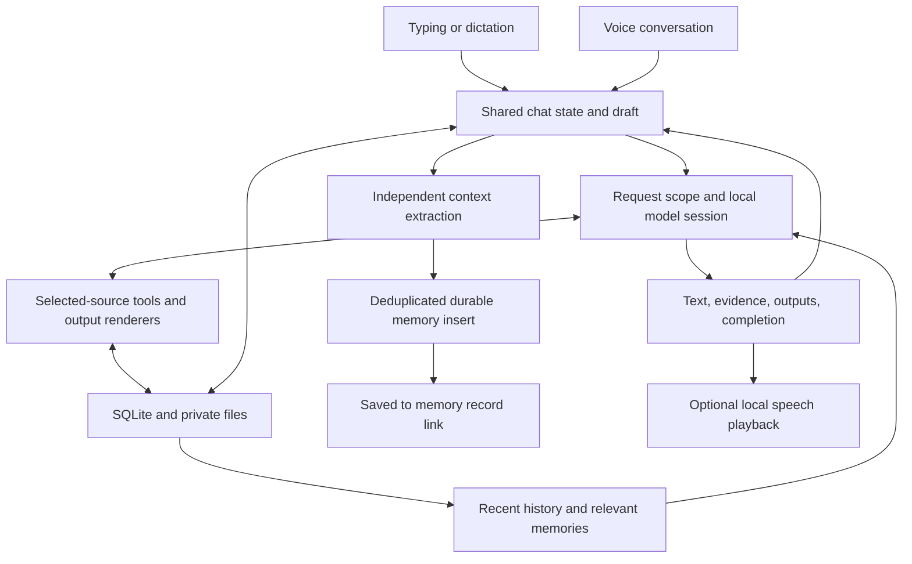

# LocalGPT architecture

One native SwiftUI app runs the conversation model, speech recognition, document extraction, retrieval, and artifact rendering locally. There is no app server or account. The UI is the approved interface; concrete services replace its development fixtures through shared contracts.

## Boundaries

| Folder | Responsibility |
| --- | --- |
| App | Startup, dependency construction, shell, lifecycle, navigation |
| DesignSystem | Existing tokens, icons, glass controls, typography |
| Features | Screens and observable presentation state |
| Domain | Codable/Sendable records, repository and service protocols, request/event types |
| Assistant | Context budgeting, local model sessions, memory extraction, scoped tools, reference validation |
| Infrastructure | GRDB, private files, Vision/PDFKit, renderers, Foundation Models availability, Apple/Whisper speech |
| PreviewSupport | Explicit DEBUG fixtures; never the default runtime |

## State and service ownership

`ChatSessionStore` is the shared presentation facade. `ConversationStore` owns active selection, draft debouncing, revisions and persistence; `AttachmentStore` owns import tasks and attachment state; `MemoryCaptureCoordinator` owns cancellable extraction through a domain protocol. Replacement-task identities reject old callbacks without allowing their cleanup to remove a newer task. Errors from child stores are surfaced by the shell. Model defaults come from the injected catalog.

`LocalAssistantClient` owns stream lifetime, deadlines and error handling. `AssistantTurn` selects the conversation, source or tool response path and validates the final answer. `SourceResponder` separates evidence gathering from source-backed writing. Explicit source-table requests select a table schema directly so the model cannot replace the requested table with prose; cell data still comes from source evidence. `ConversationResponder` preserves the native-history and bounded-recovery policy. Read Aloud is provided by the composition root through the view environment; voice receives a stop-reading callback instead of reaching into the concrete reader singleton.

## Shared glass rendering

`glassControl` delegates to the base native glass effect without custom rim, fill, tint, or opacity. Interactive controls opt into touch behavior only. The top-right system Menu is plain; its label owns this native surface, avoiding an extra native button fill. The three slots remain separate 48pt hit regions. Sheet backgrounds use the native presentation material without a custom opacity override. System appearance and accessibility preferences remain owned by SwiftUI. This supersedes the opacity choice in decision 0010.

## Startup and storage

`WorkspaceStartup` constructs live services and displays a recoverable error if storage cannot open. A Release build has the same live path as Debug. Mock services require an explicit `-preview` or `-uiState` launch argument in DEBUG.

The container carries preview identity to the composer so fixtures cannot advertise real inference. Verify the installed binary on the exact Simulator being reviewed: other booted devices may still contain historical UI-only builds.

`WorkspaceDatabase` is an actor owning one GRDB writer and versioned migrations. Records currently use Codable JSON payloads in typed collections. Conversation revisions reject stale snapshots; deletion tombstones prevent delayed tasks from resurrecting records. Draft saves are debounced; reply text is checkpointed while streaming. An interrupted streaming reply reopens as stopped. Decoded collection caches are invalidated on writes.

All chat payloads currently load at startup; this is appropriate to the bounded take-home, not a claim of unlimited-history scalability. Before large-scale use, split message rows from conversation metadata and page the feed/history. No backend or sync layer is hidden behind these repositories.

Application Support contains `workspace.sqlite`, durable originals/generated files under `Files/<id>/`, temporary durable imports under `Incoming`, and downloaded speech assets under `SpeechAssets`. The workspace is excluded from backups. Files use iOS data protection; no separate database password or application-level encryption is claimed.

## Assistant requests

`ExampleConversation.catalog` contains authored onboarding transcripts and output specifications, separate from live inference and DEBUG mocks. `ExampleConversationInstaller` prepares them through the live container before history loads, using the existing artifact writer for actual CSV, PDF, and PNG files. Stable conversation IDs plus record/tombstone checks prevent duplicates, overwriting edits, or resurrection after deletion. A shared installation task serializes concurrent loads. Unfinished installation artifacts are removed before retry. Seeding never invokes the model, speech, or memory capture. Optional internal provenance keeps older conversations decodable; it creates no special UI labels. Existing personal chats remain the startup selection. Continuations use normal inference and fictional-context guidance in chat notes. Generated files remain reply outputs and are not preselected as composer inputs. A versioned installation repair clears only the original preselected files from older seeded chats, preserving uploads and later user selections.

Ordinary chat restores bounded complete turns as native Foundation Models `Transcript` prompt/response entries. The current message is sent once, separately; failed/streaming answers never become completed model history. The context budget removes whole oldest turns. A request owns its reconstructed session, so retries, cancellation, and chat changes cannot leak state.

Ordinary replies use concise instructions, native speaker history, free-form streaming, and greedy sampling. Earlier user messages are not duplicated into the latest prompt. Live comparison found that extra conversational rules and a guided schema for every reply degraded recall and speaker attribution.

Conversation responses are checked for substantial repetition of recent answers to different prompts, and for copying the latest user message without a request to quote it. Replies up to 30 words are held until complete so they can be checked before display; longer replies stream after their opening. A detected copy gets one guided model recovery attempt retaining user context but excluding prior assistant prose. An explicit repeat request bypasses this check. Numeric and polarity changes are not treated as copies. If recovery also repeats, the app reports a failure rather than presenting the repeated answer as successful. This bounds one observed failure mode; it does not establish broad conversational quality.

A send captures conversation ID, source IDs, recent history, model identity, notes, and originating user-message ID. `ContextBuilder` budgets the prompt using the runtime's token counter/context size when supported, reserving space for replies and tools. It drops older history before rejecting an oversized input. Memories are ranked against the current prompt with recent context as a fallback; memory removal affects subsequent requests.

For document-only answers, evidence gathering and final writing use separate sessions; the final writer receives retrieved passages, prior user turns, and the latest question without callable tools. Previous generated answers are excluded from this stage because a live revision test exposed stale conclusions overriding changed requirements. The writer uses a guided structure for paragraphs and bounded table cells; Swift renders Markdown as fields stream in, avoiding free-form table whitespace loops. A single explicit numeric requirement uses direct number/unit parsing when every source has one matching value. Other numeric questions use an isolated extraction session. Requirements and source values require matching quotes and shared adjacent units; Swift computes at-least/at-most/exact qualification and shows the supporting source details. Unsupported extractions are not accepted as numerical proof. Prompt budgeting includes the guided response schema. Short complete sources skip the redundant gathering pass. CSV calculations are registered as inspectable evidence. Each turn uses a fresh Foundation Models session, preventing source changes or forgotten memories from remaining in an opaque session cache. Streaming events carry cumulative text snapshots. A request scope revokes tool work on cancellation. A 75-second deadline reports a recoverable failure rather than leaving a permanent spinner.

Output gating recognizes explicit creation and revision language, rejects direct negations, and resolves short format corrections against the immediately previous file request. Clear chart revisions inherit only the immediately previous request's kind. DocumentResponder and VisualOutputResponder generate bounded content/data, then call the local writers directly: the model cannot substitute a capability disclaimer for saving the requested file. Simple exports of an existing answer preserve its contents verbatim. An ordinary follow-up never inherits output tools. This remains a bounded intent parser, not general language understanding. Source tools are registered narrowly; explicit output routing owns the save operation: selected-source search/read, CSV calculations, and explicitly requested file/chart/diagram creation. No shell, code execution, arbitrary network request, or external action exists. Tool calls are capped per turn. Source documents are untrusted data. Evidence IDs and numbers come from the retrieval layer; final references are checked against passages actually retrieved. Missing references get a repair pass, with an explicitly labeled “Sources read” fallback rather than an invented claim-to-source mapping.

## Documents and outputs

Imports copy originals before processing, hash content, and reuse versioned extraction results. PDFKit extracts PDF text; Vision OCR handles scanned pages and images. Passages retain page/chunk locators in an FTS5 index. Queries restrict retrieval to selected, ready sources. Removing a selected source revokes the active request. Deleting a source removes its index and disposable extraction cache; previous conversation text is separate history.

Text, Markdown, code, JSON, and CSV import as text. Office spreadsheets should be exported as CSV; unsupported formats remain previewable with an explicit analysis error. Limits protect local memory: 30 MB import, 300 PDF pages, 2 MB CSV calculation. Originals open in Quick Look. Persisted file identity uses the attachment ID and filename, resolved against the current sandbox directory. Legacy absolute file URLs are rebased when read so app reinstalls/updates do not strand previews.

Output tools create real PDF, CSV, Markdown, JSON, text, and R files, plus bar-chart and flow-diagram PNGs. PDF rendering paginates text. CSV structure and JSON syntax are validated before writing. Charts use numeric inputs and bounded dimensions. Output paths use sanitized names inside the app sandbox. Generated content is indexed so it can be selected as context in later turns. Generated images receive bounded 360-pixel PNG thumbnails at write time. The conversation feed renders image attachments through ReplyImage rather than document rows. An actor-backed preview cache downsamples originals to at most 1200 pixels away from the UI actor and bounds its encoded data cache; full-resolution originals remain available in Quick Look. Startup repairs and persists missing previews for older generated images using their resolved local file URLs. Numeric source reports reuse the verified comparison rather than allowing a second generation to alter its facts. File receipts list successfully written outputs; if generation fails afterward, the receipt preserves those files and explicitly says that remaining work may be unfinished. R files are not executed; picture generation is intentionally deferred.

## Memory

Memory extraction runs separately from reply generation, so it does not delay speaking an answer. It conservatively classifies lasting preferences, enduring personal context, and explicit remember requests; most messages produce nothing. Temporary budgets, guest counts, and task plans remain in history. A separate policy gate rejects transient context, opt-outs, and fabricated remember intent even if the extractor misclassifies them. Independent first-person clauses are presented separately so a temporary constraint does not contaminate an adjacent preference. Explicit remember-command prefixes are stripped before grounding. Every candidate requires a supporting source span. The persisted text is the user's original words, avoiding unsupported paraphrases. Questions and document content must not become personal facts. A deterministic check also rejects interrogative quotes and question punctuation, including punctuation the extractor omitted.

A memory carries the originating conversation/message IDs, exact quote, timestamps, state, and normalized fingerprint. Deduplication plus insertion is an explicit atomic repository requirement; there is no default read-then-write implementation. Both SQLite and the in-memory test repository honor it. Receipt events happen after commit. If the app closes between memory and conversation saves, load reconstructs the receipt using provenance. A failed write emits no “Saved” receipt. Retry preserves the originating message's committed receipts. The memory sheet displays only saved text. Removal stays in the list’s long-press menu and cancels in-flight requests that could still use the fact. Supporting quotes and dates remain stored internally.

These are safeguards around a probabilistic extractor, not a guarantee of flawless semantic classification. The live evaluation suite tests implicit context and recall in addition to deterministic persistence tests.

## Voice and text

`ChatSessionStore` owns one draft and conversation. `VoiceSessionController` owns capture/playback state and generation tokens, rejecting stale callbacks after mute, navigation, or keyboard handoff. Dictation never auto-sends and remains active across utterances and quiet capture windows. Each finalized segment becomes the next window’s draft prefix. Finish requests a final audio flush, with a bounded timeout preserving already-transcribed text. Voice mode submits an ended utterance, speaks the completed reply, and starts the next capture window within the same ongoing call. Empty capture completion rolls over without sending. Capture stops during playback. Switching to typing stops audio but preserves the draft and reply.

Voice retires a capture token before sending, follows the specific resulting reply, and cancels an older playback observer before creating another. A blocked send cannot speak the previous reply again. Recognition updates replace overlapping audio-range hypotheses so shifted timestamps do not append the same phrase twice.

`LocalAudioSession` owns AVAudioEngine and synthesis. A conversation ID leases the play-and-record audio session across listening, model work, and playback; it is released only when the call exits. Per-turn IDs still reject stale callbacks. Quiet capture windows rotate instead of failing after 50 seconds. Whisper keeps a bounded silent pre-roll before speech, so waiting cannot fill the utterance cap. `AnalyzerCapture` uses SpeechAnalyzer when available; `WhisperCapture` provides local transcription elsewhere. The speech runtime keeps a warm model and serializes inference. Permission callbacks and audio callbacks are explicitly nonisolated/Sendable and only update presentation state after hopping to the UI actor. Opening a sheet or drawer does not exit voice; changing chats and backgrounding stop audio; temporary system permission sheets do not discard the session. Conversation playback and Read Aloud share a local voice selector: prefer the highest installed quality for the system speech language and dialect, preserve the system choice on ties, and exclude novelty and personal voices from automatic selection. Re-enumeration picks up newly downloaded voices on the next playback. Read Aloud also reports audio setup/cancellation/stall failures and advances its player only after real synthesis callbacks. Perceptual dB metering makes ordinary microphone levels visible in the dictation waveform. Typed playback events distinguish completion from failure; interruptions, canceled playback, and a stalled synthesis callback produce a recoverable state while retaining the text reply. Capture resumes only after successful playback.

## Verification and remaining platform gates

The deterministic test scheme covers persistence, stale writes, deletion, caching, memory receipts, CSV/PDF/files, and voice handoff. `PumaWorkspaceLiveChecks` invokes the real Foundation Models service and checks document comparison, memory extraction/recall, and output files. Run it separately because model availability and quality are runtime-dependent. See `docs/verification.md` for observed results and remaining gates; a successful compile alone does not validate inference, microphone audio, or device performance.

## Device attachment corrections — 2026-10-03

Conversation.draftSourceIDs separates unsent composer inputs from selectedSourceIDs retained for follow-up context. Optional decoding keeps old chats readable; legacy source receipts are excluded from the composer. Sending writes the input IDs onto the user message and clears only the pending list. Importing or failed inputs cannot be silently omitted. Assistant file rows render generated outputs only; source access remains in citations and Outputs. Photos without OCR text retain their originals and may be sent, with an explicit OCR-only capability response on older systems.

## Image prompting — 2026-10-04

On iOS 27, ImageInputSupport checks the system model's vision capability and builds a multimodal Prompt from selected ready images and the same bounded conversation/source context. The shared preview cache decodes orientation-corrected images at up to 1200 pixels off the UI actor. Original files remain durable; cached previews are disposable. Up to four selected images are accepted, subject to context limits; unreadable inputs fail explicitly instead of silently disappearing.

Ordinary visual answers stream from the image-capable session. File/chart/diagram responders accept the same Prompt, so image-based export requests reach the existing validated writers. Reopened chats resolve image files against the current sandbox and retain source selection. Voice and typing enter the same AssistantTurn.

The tested iOS 27 runtime accepts image generation requests but rejects tokenCount on an image-bearing Prompt. Preflight counts text and tools, reserves 1024 tokens per bounded image plus 2400 for instructions/schema/output, and leaves exact multimodal context enforcement to the framework. This is an allowance, not an exact image token count. Typed iOS 27 context/capability errors produce actionable user messages. No Private Cloud Compute or other remote inference provider is used.
