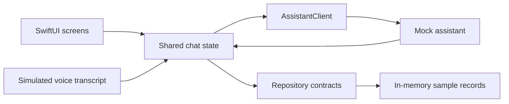
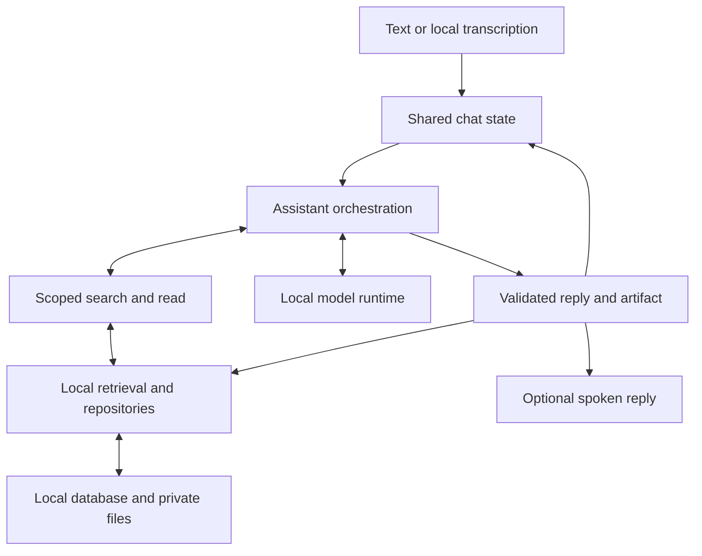

# Puma Workspace architecture

The project is one native SwiftUI iPhone app. Its folders separate interface, shared contracts, assistant behavior, and concrete local services. The first implementation phase uses fixtures and mock services.

## Folder ownership

| Folder | Responsibility |
| --- | --- |
| App | Entry point, root shell, navigation, and dependency wiring |
| DesignSystem | Visual tokens and reusable controls |
| Features | Screens, components, and presentation state |
| Domain | Shared data types, IDs, events, and service contracts |
| PreviewSupport | Sample records, mock replies, simulated speech, and in-memory repositories |
| Assistant | Future orchestration, context assembly, bounded tools, validation, and cancellation |
| Infrastructure | Future model runtime, real speech, local persistence, extraction, and retrieval |
| Resources | Assets, samples, and localization |

These are logical boundaries inside one app target. A separate Swift package can follow if another target needs the core.

## Current scaffold and UI phase

The app entry point and empty RootShell exist. Feature and service directories are reserved and tracked. The actual interface and mock services are the next step.

AppContainer will provide concrete dependencies. ChatSessionStore will present the active conversation, draft, messages, selected sources, chosen model, artifact edits, and reply state. Voice and keyboard input update that same draft. Voice capture/playback state and navigation have focused owners that refer to the active conversation.

Define only interfaces needed by the UI. Views render presentation state; that state calls shared contracts. Mock behavior belongs to the UI development configuration. Database migrations, model setup, indexing, and real audio are later integration work.

## Complete system later

Assistant lives inside the app and owns a request's context, tools, output validation, and lifecycle. Infrastructure/LocalInference runs the selected model. Infrastructure/Persistence implements local repository contracts. AppContainer replaces mocks with these implementations.

1. Send captures the draft, conversation revision, model, selected source versions, and approved memory references.
2. The assistant prepares relevant history and evidence. Its search/read tools enforce the selected source scope and return bounded passages with original locators.
3. The local model produces reply events. The assistant validates structured answers and references before accepting an artifact. Streaming text can remain provisional.
4. Accepted events update the interface and local history. Optional speech uses the same accepted answer.
5. Artifact and memory changes pass through app actions. The model proposes; the person and app control application.

Stopping work, changing chats, removing a source, or changing memory revokes affected callbacks before another scope becomes active. Old model or speech events cannot overwrite a newer draft or restart stopped work.

## Local data ownership

The future database stores conversations, messages, source metadata/versions, selections, artifacts, approved memory, and bounded operational records. Original imported documents live in private local files. Derived text/OCR and search indexes retain locators to the originals.

Selected sources grant access to relevant excerpts; they are not inserted wholesale into every request. Source deletion revokes access before cleanup, and historical citation controls become unavailable. Model session caches are temporary computation. Durable history and explicit memory belong to repositories.

## Build configuration

`project.yml` generates the committed Xcode project with XcodeGen. The initial UI scaffold uses Swift 6 and targets iOS 26, matching the available development toolchain. It has no external package dependencies. The final runtime/model and device requirements will be selected during integration.

Keep generated personal Xcode state, build products, credentials, and model weights outside Git. Add meaningful tests as state transitions and service contracts are implemented.
