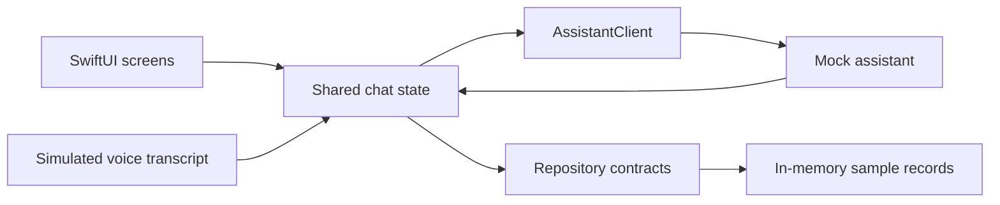
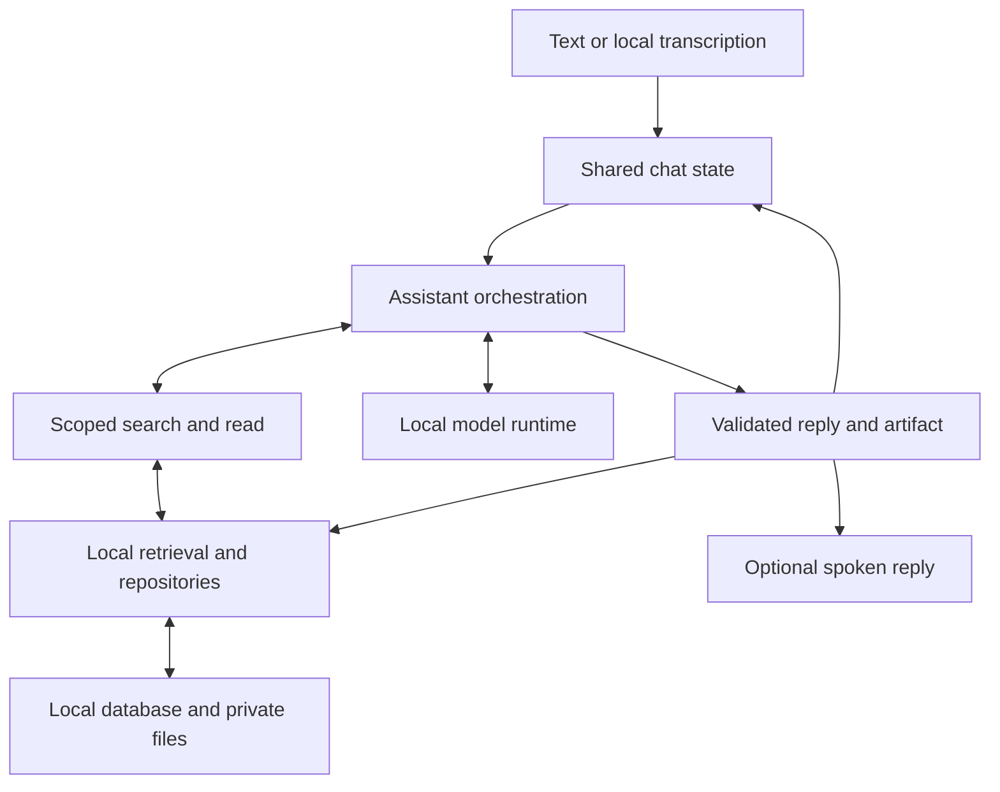

# Puma Workspace architecture

The project is one native SwiftUI iPhone app. Its folders separate interface, shared contracts, assistant behavior, and concrete local services. The first implementation phase uses fixtures and mock services.

## Folder ownership

| Folder | Responsibility |
| --- | --- |
| App | Entry point, root shell, navigation, and dependency wiring |
| DesignSystem | Visual tokens and reusable controls |
| Features | Screens, components, and presentation state |
| Domain | Shared data types, IDs, events, and service contracts |
| PreviewSupport | Sample records, mock replies, simulated speech, and in-memory repositories |
| Assistant | Future orchestration, context assembly, bounded tools, validation, and cancellation |
| Infrastructure | Future model runtime, real speech, local persistence, extraction, and retrieval |
| Resources | Assets, samples, and localization |

These are logical boundaries inside one app target. A separate Swift package can follow if another target needs the core.

## Current UI phase (implemented with mocks)

`AppContainer` (App) holds the concrete dependencies behind Domain contracts. In DEBUG it wires `MockAssistantClient`, `MockSpeechClient`, in-memory actor repositories, and `FixtureModelCatalog` from PreviewSupport. Release has no real services yet and stops at launch.

Domain types (all `Sendable` value types): `Conversation` (with a pinned flag), `Message` (status complete/streaming/stopped/failed, Markdown text, work steps and their duration, the IDs of the documents it worked from, and an optional `Comparison` artifact), `Attachment` (a kind inferred from the file extension, readiness ready/importing/failed/removed, an optional thumbnail, and the URL of the app's copy of the file), `LocalModel` (ready/preparing/needsSetup/unsupported), `Citation` (locator, excerpt, UTF-16 span), `Comparison` (criteria × options cells, unknowns, revised criterion), and `MemoryItem`. Contracts: `AssistantClient.send(_:) -> AsyncStream<ReplyEvent>`, `SpeechClient.listen()/speak(_:)`, `ConversationRepository`, `AttachmentRepository`, `MemoryRepository`, and `ModelCatalog`. `ReplyEvent` carries work steps, the documents used, text tokens, an artifact, a memory proposal, failure, and completion. Stopping is cancellation of the consuming task.

UI state is three `@MainActor @Observable` owners injected through the SwiftUI environment:

- `ChatSessionStore` (Features/Chat/State) owns conversations, the active chat's draft, messages, selected sources, model, and notes, plus attachments, models, memories, and the pending memory proposal. Each reply stream carries a token; switching chats, stopping, or starting a new reply replaces the token, so late events from an older stream are dropped and a streaming message is marked stopped.
- `VoiceSessionController` (Features/Voice/State) owns idle/listening/muted/finalizing/speaking/unavailable, the live transcript, and a smoothed energy value for the aura. It writes the transcript into the shared draft; leaving voice keeps the draft and never sends. The end of a spoken utterance sends that turn and speaks the reply.
- `NavigationState` (App) owns the drawer flag, the single active sheet, the add surface, search and find-in-chat state, the feed's scroll requests, and the short notice shown under the top bar. Opening the drawer or a sheet pauses voice.

`RootShell` composes the drawer back layer, the push-revealed `ChatScreen`, and `.workspaceSheets()`. `DebugLaunchState` (DEBUG) applies a `-uiState <name>` launch argument after loading so each review state can be opened directly.

## Where the UI phase went past mocks

Three things use real system services rather than mock ones, because they are interface behavior and need no model or database:

- **Picking sources.** The add surface reads recent photos with PhotoKit, shows a live viewfinder with AVFoundation, and uses the system photo picker and file browser. Imported files are copied into the app's caches folder so they can be opened later. Nothing reads their contents; the import that follows is still simulated.
- **Viewing files.** Files open in Quick Look. The sample attachments are real files written on first use (a PDF, text, PNG, CSV, and Markdown file) so they open the same way.
- **Read aloud.** `SpeechReader` (Features/Chat) reads a reply with the system speech synthesizer. It is separate from `SpeechClient`, which remains the mock contract for voice conversation.

These live in Features, not Infrastructure. When integration starts, the file copy and the speech path should move behind Domain contracts.

## Presentation notes

- Replies are rendered by `MarkdownText`, a small block parser (headings, paragraphs, lists, code, quotes, tables, rules) over `AttributedString` inline Markdown. Comparisons are Markdown tables. `ComparisonCard`, `CitationChip`, and `EvidenceSheet` remain in the tree but no reply shows them now; `Comparison` artifacts are still attached to messages by the mock.
- The feed scrolls to a message through `ScrollViewReader`. Its `ScrollPosition` only ever targets the bottom edge: tracking message identity made the feed snap whenever a reply changed height.
- Glass applied by the app does not draw inside a clipped view, and flashes black around a system `Menu`; see [decision 0006](decisions/0006-system-components.md).

Define only interfaces needed by the UI. Views render presentation state; that state calls shared contracts. Mock behavior belongs to the UI development configuration. Database migrations, model setup, indexing, and real audio are later integration work.

## Complete system later

Assistant lives inside the app and owns a request's context, tools, output validation, and lifecycle. Infrastructure/LocalInference runs the selected model. Infrastructure/Persistence implements local repository contracts. AppContainer replaces mocks with these implementations.

1. Send captures the draft, conversation revision, model, selected source versions, and approved memory references.
2. The assistant prepares relevant history and evidence. Its search/read tools enforce the selected source scope and return bounded passages with original locators.
3. The local model produces reply events. The assistant validates structured answers and references before accepting an artifact. Streaming text can remain provisional.
4. Accepted events update the interface and local history. Optional speech uses the same accepted answer.
5. Artifact and memory changes pass through app actions. The model proposes; the person and app control application.

Stopping work, changing chats, removing a source, or changing memory revokes affected callbacks before another scope becomes active. Old model or speech events cannot overwrite a newer draft or restart stopped work.

## Local data ownership

The future database stores conversations, messages, source metadata/versions, selections, artifacts, approved memory, and bounded operational records. Original imported documents live in private local files. Derived text/OCR and search indexes retain locators to the originals.

Selected sources grant access to relevant excerpts; they are not inserted wholesale into every request. Source deletion revokes access before cleanup, and historical citation controls become unavailable. Model session caches are temporary computation. Durable history and explicit memory belong to repositories.

## Device scale

The interface is designed at the iPhone 17 Pro's width (402pt). `Tokens.uiScale` is the screen width divided by 402, clamped to 1...1.15. Every length goes through it: `Font` styles in `Typography.swift`, `Icon` sizes (scaled inside `Icon`, so callers pass baseline points), and all padding, gaps, sizes, and corner radii through `pt()` or `Tokens.scaled()`. New layout code must not use a bare number for a length. System-presented UI (alerts, context menus, the sheet chrome) is not scaled.

## Build configuration

`project.yml` generates the committed Xcode project with XcodeGen. The initial UI scaffold uses Swift 6 and targets iOS 26, matching the available development toolchain. It has no external package dependencies. `project.yml` declares camera and photo-library usage descriptions for the add surface. The model is Apple's on-device system model through Foundation Models ([decision 0005](decisions/0005-on-device-system-model.md)). Image input needs the iOS 27 SDK, so integration requires Xcode 27 and a deployment target of iOS 27; the installed toolchain is Xcode 26.6 with the iOS 26.5 SDK.

Keep generated personal Xcode state, build products, credentials, and model weights outside Git. Add meaningful tests as state transitions and service contracts are implemented.
