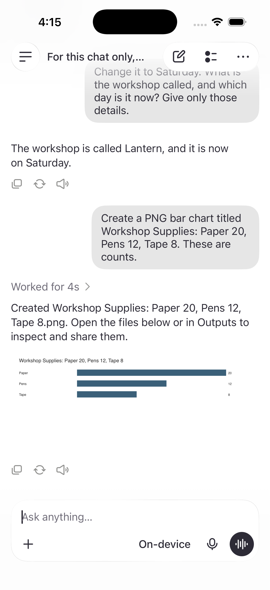
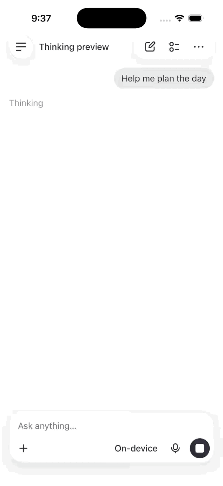
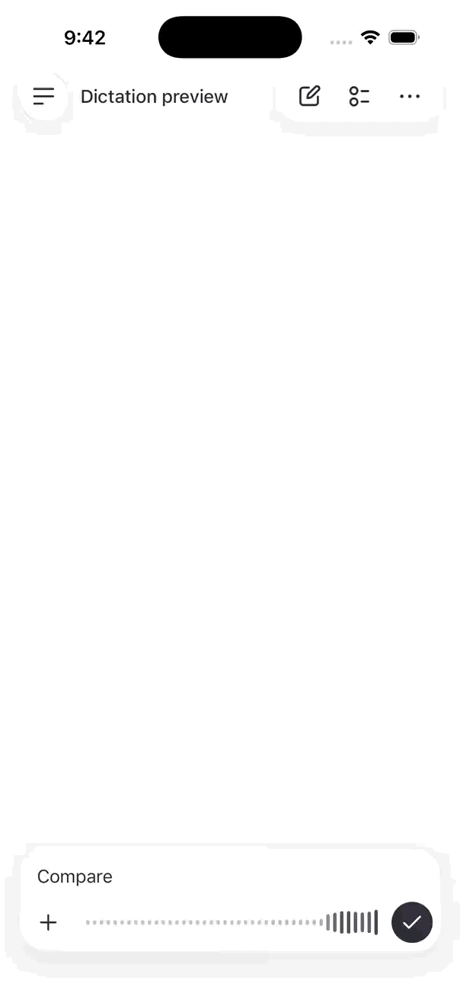
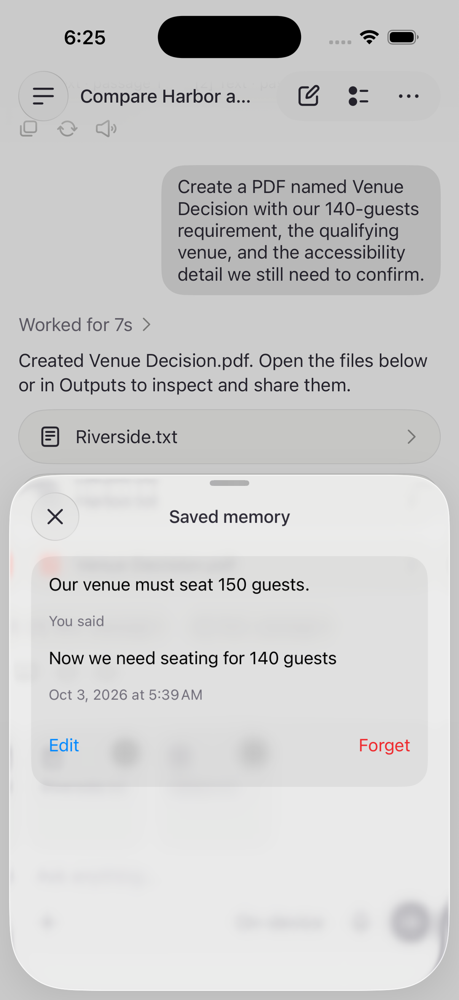
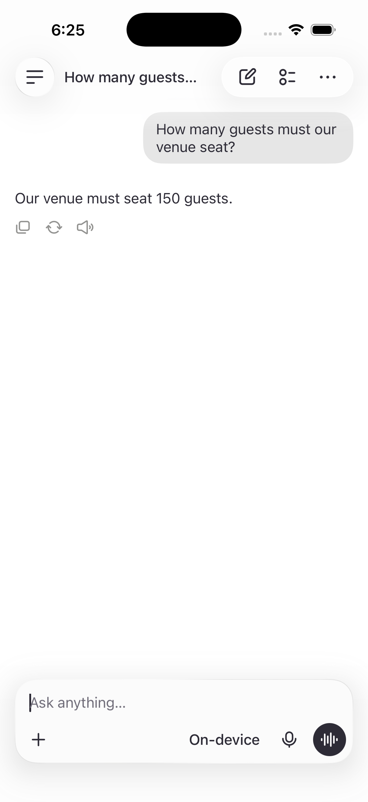

# Verification — 2026-10-03

## Current core acceptance — 2026-10-03, source 74f84a4

On Xcode 26.6 / iOS 26.5, the dedicated **Puma – Audio QA** Simulator completed **32 deterministic checks and all 18 live checks with no failures or skips**. The live suite used the real local model for ordinary conversation, source-backed comparison and revision, selective memory, CSV calculations, and real PDF/CSV/R/PNG outputs. Two recorded voice turns used actual recognition, inference, and synthesis, and returned to listening. Recorded input is not live microphone acceptance.

Fresh conversation checks retained the spaceship name Juniper, changed Omar's deadline from Wednesday to Friday while preserving Maya's Tuesday deadline, recalled Miso/Sundays within a chat, and treated the plant name as unknown in a separate chat. A conversation saved through SQLite reopened with its draft and history intact; its project remained Cedar while its release day changed from Monday to Thursday. These checks use temporary empty workspaces, not the preloaded transcripts.

Manual response review found useful sky/sunset explanations and a correct three-heart octopus fact in this run. Limits remain: a request for two sentences produced three, and recovery from a saved greeting loop still produced a generic offer of help. Earlier prompt experiments fabricated missing personal details and confused speakers; they were discarded. Passing sampled checks does not make the local model broadly reliable or eliminate hallucinations.

### Live interface and reviewer build

- In a fresh normal UI chat, the model retained Lantern and changed its workshop day from Tuesday to Saturday. A new chart request rendered Paper 20 / Pens 12 / Tape 8 inline, with correct relative bar lengths; tapping opened the actual PNG in Quick Look. The composer stayed free of automatically selected outputs.
- Left an unsent draft, terminated the app, installed the clean-checkout build in place, and relaunched. The same history, generated chart, and draft remained visible.
- Built committed source 74f84a4 from a separate clone with separate build and package directories using the README's generic Simulator build. Package resolution and compilation succeeded. This is a clean source/build check on a configured Mac, not proof of model availability or microphone permissions on an unconfigured reviewer device.
- Latest UI evidence below is live generation, not an authored preloaded chat or a DEBUG fixture.

### Remaining device checks

Live microphone capture and an actually disconnected physical-device run remain pending. Prepare model assets first, disable Wi-Fi as well as cellular, send a new request, generate a file, and reopen the saved conversation. The [recording outline](video-walkthrough.md) describes this without treating cached content or status-bar appearance as offline proof. Do not describe recorded-audio checks as a live microphone call.

The following sections preserve earlier observations; the current acceptance above supersedes their test counts and build state.

## Current branding — LocalGPT

The generic Simulator Debug build passes with LocalGPT as its bundle display name. Updated the Pro Max Simulator in place and observed both the LocalGPT app label and drawer heading. The existing chat remained available after relaunch. This branding change does not establish any improvement in conversation quality.

## Conversation behavior — native history and bounded repetition

Ordinary conversation now restores native speaker roles, budgets whole completed turns, and has a single guided-generation recovery attempt for substantially repeated text. There are no scripted replacement replies. All 29 deterministic checks passed after the transcript and repetition logic changes. Four targeted live checks passed together on Pro Max after the final prompt/recovery changes: the reported three-turn exchange plus a subsequent invented-name recall, a seeded repetition case, memory extraction/recall, and a brief context acknowledgment. The live request helper now includes the current user entry and streaming placeholder, matching the UI. The recorded two-turn voice workflow passed before the final prompt/guided-recovery refinement.

Important limit: isolated checks initially passed while retrying the real saved chat still produced repetition failures twice. The final Pro Max retry returned different wording, but remained a generic offer of assistance. This is NOT acceptance of natural conversation quality. Some fresh replies were also generic or awkward; memory recall missed a supplied fact during intermediate runs before clarifying the background prompt. Tests establish narrow mechanics and sampled recall, not robust model quality or semantic recovery. Further model/prompt evaluation should use varied conversations and human review, not exact-duplicate checks alone.

## Previous revision — live installation and preview identity

The iPhone 17 Pro Max Simulator was running an old UI-only binary, despite the dedicated Audio QA Simulator having live services. Its repeated upload-documents response matched the mock assistant exactly. Updated Pro Max in place to the current Debug build, without uninstalling. Voice preparation was visible afterward; microphone acceptance was not established.

On Audio QA, an explicit `-preview` launch exposed the "UI preview" label and scripted-reply accessibility explanation. A normal launch restored live services. With no attachments, the real model answered why the sky is blue and the user's high-level cure-development question, without asking for documents. The sunset follow-up incorrectly repeated the earlier blue-sky explanation, and an old irrelevant saved memory leaked into acknowledgment wording. These are observed model/context quality limitations, not a passing broad knowledge or multi-turn benchmark. The Debug build passes.

## Previous revision — consistent clear glass

The updated Debug build passes. Light/dark screenshots show the left circle and right capsule sharing the same rim and fill. The right Menu opens and dismisses, and its independent Outputs target opens Outputs. Recorded dark menu transitions were inspected at the recording's 10fps around opening and closing; no solid black flash was observed. Light/dark sheet foreground remained legible with its background alone reduced to 55% opacity. This is visual Simulator review, not a complete accessibility/contrast certification. Appearance was restored to light after review.

## Previous revision — centered file sheet and voice selection

- The Uploaded files empty state was visually inspected at medium and large detents; its icon/text group is centered in the body below the header. Nonempty content retains top alignment and scrolling.
- The local voice inventory/selection check and both actual synthesis checks pass (consecutive Read Aloud replies and two recorded voice turns with scripted assistant replies). The Debug app build passes after the final comparator adjustment.
- This iOS 26.5 Simulator exposes only default-quality en-US voices (Samantha, Fred, Junior, Kathy, Ralph); the shared selector picks Samantha. No Enhanced or Premium voice asset is installed here. The new policy prefers a higher installed quality in the same language/dialect but does not itself download assets or prove an audible improvement on this Simulator.

## Previous revision — Apple model assets restored

After Apple Intelligence was enabled on the host Mac and its assets became usable, a real Simulator reply succeeded. The missing-model-catalog failure is no longer reproduced.

The full 13-case integration run then exposed memory false negatives: a broad quote mixed a lasting preference with a temporary budget, and a leading “Please remember” was rejected as an ordinary request. Extraction now presents independent first-person clauses and strips only the explicit memory-command prefix before grounding. Existing conservative policy gates remain. The voice test also incorrectly expected a new receipt on a repeated fact; it now checks the originating committed receipt and no duplicate receipt.

All 27 deterministic tests pass on the repaired revision. The four affected live checks pass together after that repair: explicit/lasting memory, mixed preference/budget extraction and recall, temporary-context rejection, and two recorded voice turns with the real model and actual speech playback. The other nine cases passed in the preceding full run; a single all-green 13-case run on the final revision has not been claimed. Microphone capture is still replaced by recorded PCM in the voice check.

## Previous revision — dictation and playback feedback

- **Deterministic checks:** 25 tests pass. Dictation accumulates sentences across capture windows and silence, stays separate from sending, and flushes the last transcript on Finish. Microphone level mapping and the smoothed visual envelope are covered.
- **Actual audio services:** three targeted checks pass together: finishing recorded dictation flushes pending PCM through Whisper; Read Aloud speaks two consecutive replies with system synthesis callbacks and completion; two recorded voice turns use real recognition and synthesis with scripted assistant replies and return to listening.
- **Visual checks:** the Thinking highlight visibly moves across its text; dictation bars respond and scroll. A DEBUG mock-input session remained dictating for over a minute without sending a message, then Finish restored the composer. The GIFs below use DEBUG fixtures, not live microphone input.
- **Release:** the generic Simulator Release build passes. Manual checks use a separate “Puma – Audio QA” Simulator so the user's existing session is undisturbed.
- **Asset preparation:** the first audio run timed out while acquiring speech assets; subsequent checks prepare assets before measuring conversational behavior. This is not a first-install latency claim.
- **Limits:** full microphone-to-model conversation and disconnected-network acceptance remain pending. The Apple model-catalog blocker was subsequently resolved as described above.

 

## Previous revision — selective memory and continuous voice

Kenny’s latest feedback supersedes broad automatic memory and the detailed Edit/Forget sheet. Current memory selection is limited to lasting context or explicit requests; current sheets show only saved text. Voice owns an ongoing foreground audio session across turns and quiet windows.

- **Deterministic checks:** 23 tests pass, including two voice turns, playback/capture ordering, quiet recognizer rollover, mute and keyboard handoff, long pre-speech silence, and rejection of temporary/task memory candidates.
- **Audio integration:** two recorded speech turns pass with real Whisper recognition and Apple speech synthesis, using explicitly scripted assistant replies to isolate audio from model availability. After both replies the controller remains listening and the audio category remains play-and-record.
- **Release:** the generic Simulator Release build passes.
- **Earlier model-runtime blocker (subsequently resolved):** the expanded live suite fails because Apple’s runtime reports missing model-catalog assets (`com.apple.UnifiedAssetFramework`, code 5000) despite reporting the system model available. One restart of the dedicated Simulator did not recover it. New memory classification and two-turn real-model integration therefore remain unverified on this revision. Earlier successful inference runs below are historical evidence, not a pass for this changed policy.

## Environment

- Xcode 26.6; iOS 26.5 Simulator on macOS 26.5.1.
- Dedicated “Puma Workspace – UI” Simulator; normal live service configuration.
- The system language model was available and generated real responses. No fixture assistant was used in the opt-in live suite.
- No physical-device performance claim. Current Xcode 27 requires a Mac OS update on this machine; direct image-model integration remains deferred.

## Earlier integration baseline (before this feedback)

| Check | Result |
| --- | --- |
| Default test scheme | 20 tests passed: stale saves, tombstones, interrupted replies, scoped search, memory commit/dedup/failure, verbatim evidence, CSV parser, PDF pagination, safe files, content-cache reuse, sandbox relocation including legacy URLs, OCR, generated-content indexing, question rejection, quote-validated numeric qualification, and voice/draft/playback-failure state transitions. |
| Real model: memory | Implicit quiet-venue and budget context extracted, saved, and recalled; no unsolicited output files. A mixed requirement/question saves the context and rejects the question. |
| Real model: comparison | Two imported proposals compared with source references; follow-up guest-count change identifies both venues and missing accessibility information. |
| Real model: files | Actual PDF, CSV, and R files created; PDF opens, CSV values parse, file contents exist. The source-report check also reads the PDF text and verifies the original capacity values and qualification, rather than only checking file existence. |
| Real model: graphics | Actual bar-chart and flow-diagram PNGs decode successfully. |
| Local recorded speech | Production audio conversion plus Whisper base transcribed “I prefer outdoor venues with quiet gardens.” correctly. |
| Recorded voice workflow | Recorded audio passes through real recognition, the shared voice controller, local model, memory commit/receipt, and actual synthesis callbacks; keyboard handoff returns to idle. This replaces the microphone source only. |
| Calculation and response shape | CSV arithmetic uses the calculation tool and returns its evidence. A simple preference receives a brief acknowledgment without a table or unsolicited file. |
| Simulator UI | Saved memory receipt opens the matching quote/date/edit/forget sheet; history and memory survive relaunch; a new chat recalls saved context. Files-picker imports, original-file preview after sandbox relocation, citation details, the verified 140-person revision, and its generated PDF were inspected in the live app. Forget removed the test record and reduced the Outputs count. Editing a synthetic requirement from 140 to 150 guests preserved its original quote; a fresh chat recalled 150. The edited memory and an unsent draft survived an intentional relaunch. Starting and finishing dictation preserved that draft without sending it. |
| Release configuration | Generic Simulator Release build succeeded with live services. |

Before the selective-memory/continuous-call revision, all nine live checks passed together; all 20 deterministic checks and the generic Simulator Release build also passed. These are a small repeatable evaluation set, not a general model-quality guarantee. Test responses are attached to Xcode's result bundle.

## Sample Simulator timings

Earlier free-form-answer baseline (warm/downloaded assets, not a benchmark; the structured source-answer path below supersedes these document timings):

- Memory-backed answer: first text 0.61 s, complete 1.06 s.
- Two-source comparison: first text 0.65 s, complete 3.48 s.
- Revised requirement: first text 0.73 s, complete 3.57 s.
- Generated-file/image requests: complete approximately 1.97–2.97 s each.
- Recorded speech: complete 1.40 s for the short fixture.

The final source checks observed 3.29 s for the initial comparison, 0.21 s for the direct numeric revision, and 4.42 s for the verified PDF report. CSV calculation plus a structured answer has taken about 7.7–10.0 s. These are Simulator samples with active development work, not device performance targets.

Whisper model assets occupied approximately 149 MB after installation; tokenizer/support files are additional. First-use download time depends on connection and asset availability. No phone memory, battery, or thermal measurement has been made.

## Remaining checks and limits

- **Live microphone:** recorded audio does not prove microphone capture; permissions, asset preparation, and recovery render, but the Simulator did not transcribe speech played through the Mac speakers. Recorded-audio inference passes. A real spoken microphone test remains pending; do not describe full voice conversation as verified end to end.
- **Offline:** the implementation has no remote inference/transcription path and caches required assets. A network-disconnected end-to-end run has not been observed. Do not confuse cached-model tests with verified offline operation.
- **Physical hardware:** camera capture, Bluetooth routing, interruption/resumption, latency, memory pressure, and thermal behavior need an iPhone pass.
- **Images:** Vision OCR reads image text. General scene reasoning and AI picture generation are not supported in this build.
- **Context:** recent history and memories are bounded; up to six selected sources per request. Retrieval is lexical FTS, not semantic embeddings. Long/complex documents can exceed the local model's budget and return an actionable error.
- **Evidence:** references must name retrieved passages. This validates provenance, not factual entailment; inspect the excerpt. A “Sources read” fallback explicitly signals when inline attribution was not produced.
- **Memory:** extraction is probabilistic. Stored context requires a verbatim user quote. Remove in the memory list’s long-press menu removes the memory record, while original chat messages remain. Deleting a chat does not implicitly forget its already-saved global memories.
- **History:** conversation payloads currently load in full. Large-history pagination is future work.
- **Formats:** Office files require export to PDF/text/CSV. R files are not executed. Charts are bounded nonnegative bar charts and diagrams are ordered flows.
- **UI:** broad accessibility, large text, all device sizes, and complete light/dark regression checks remain beyond the observed Simulator pass.

## Reproduce

Use the commands in [README](../README.md). The default scheme does not require a model or network. `PumaWorkspaceLiveChecks` requires available Foundation Models and local speech assets; a missing system model skips its model-dependent cases with an explicit reason. The recorded-audio case tests speech separately and may acquire public assets on first use.

Run automated tests before manual Simulator inspection: Xcode intentionally relaunches the test host. For a manual pass, launch the app without `-preview`/`-uiState`, then follow the PRD demonstration. Turn off capture when finished.

## Earlier Simulator memory receipt (superseded detail UI)

Synthetic venue-preference test, normal live services, after retry and relaunch. The receipt opens the exact saved quote and its controls.

 

## Source workflow regression

Importing the fictional [review inputs](demo/README.md) through the actual Files picker produced the expected initial comparison. Opening its citation showed the original Harbor passage below. The follow-up initially reused a source capacity as the user requirement; the original test only checked venue names and was too weak. The strengthened regression requires the new 140-person requirement, rejection of the smaller venue, and identification of the qualifying venue. Final source writing excludes previous generated answers and uses guided paragraphs/table cells. Numeric qualification is computed in Swift from quote-validated requirements and source values; the supporting passages remain visible. This addresses both stale conclusions and runaway free-form table formatting. These bounded checks do not establish general factual reliability.

The repaired live app reopened the imported original after installation changed its sandbox directory. Its revised answer rejects Harbor and qualifies Riverside using the quoted 140-person requirement.

 

The generated PDF was opened from the final reply and visually inspected. It preserves the 140-person requirement, Harbor’s 120-person capacity and $3200 price, Riverside’s 160-person capacity and $4100 price, and the unspecified accessibility information.

## Historical memory edit and draft recovery (superseded UI)

The synthetic seating requirement was edited through its saved-memory sheet from 140 to 150 guests. The record retained the original quote, and a new chat with no sources answered 150. After an intentional terminate/relaunch, Memories still displayed the edited value and the active composer retained its unsent draft. Entering and finishing dictation also retained that draft without adding a user message. This checks UI state transitions, not successful microphone transcription.

 

## Editable starters — October 3, 2026 (superseded)

The final four catalog prompts passed a focused real-model check on iOS 26.5 Simulator with Xcode 26.6: notes retained the three owners, tasks, and deadlines; the generated CSV parsed with a total of 75; the PDF decoded and contained projector and feedback tasks; the PNG decoded as an image. Every prompt explicitly opts out of memory. This is a sample acceptance check, not a general quality benchmark or verification of all suggested follow-ups.

On a fresh normal launch of the installed build in the Audio QA Simulator, all four starter rows fit above the composer. Tapping the PDF starter filled the complete editable draft without creating a message or starting generation. New chat restored the four rows. This UI pass covers the default text size in light mode, not all accessibility sizes or devices.

Earlier candidate prompts exposed omissions in open-ended notes and comparison responses, including a runaway blank-line response. The final notes example uses a short, explicit task; the comparison example was replaced with CSV generation. Those broader model-quality limitations remain unresolved. iOS 27 image understanding has not been integrated or tested in this iOS 26 build.

## Preloaded conversations — October 3, 2026

Four authored, two-exchange chats now replace prompt starters. They appear in ordinary history without a special label or section. They are prepared content, not model-generated transcripts. The existing local writer creates real CSV, PDF, and PNG files; no model or memory extraction runs during installation.

The final full deterministic suite passed all 30 tests. The added persistence test covers concurrent installation without duplicates, preservation of an existing chat, valid CSV/PDF/PNG files, no seeded memories, preservation of edits/drafts, and no resurrection after deletion. The seeded CSV totals 80; the PDF contains the added microphone check; the PNG decodes.

In the normal Audio QA Simulator app, the four conversations appeared alongside existing history without starter buttons or a special section. Opening the workshop conversation showed both exchanges and its actual PDF, which was opened and visually inspected. The budget conversation displayed its breakdown; its PNG attachment was opened and visually inspected. This pass does not establish live-model follow-up quality or voice behavior.

## Generated-image previews and composer inputs — October 3, 2026

All 31 deterministic tests passed. The new regression models an older seeded chart with a missing thumbnail and preselected output, then verifies that upgrade removes only the original output selection, preserves an imported selection/title/draft/messages, produces a decodable preview no larger than 360 pixels, retains the original file, and respects a later intentional reselection. New generated PNGs carry thumbnails immediately.

The updated normal Audio QA Simulator build opens the budget conversation with an empty composer and its PNG still linked in the reply. The full chart opens through Quick Look. The blank composer tile in the earlier screenshot was caused by a missing thumbnail on a wrongly preselected output, not a missing PNG original.

## Inline image replies — October 3, 2026

The Simulator build succeeds with image-specific reply rendering. On the installed Audio QA build, the budget chart is visible directly beneath the assistant text at its full aspect ratio, without a filename capsule. Tapping it opens the original in Quick Look. The composer remains empty. Feed previews are bounded to 1200 pixels and cached; non-image receipts retain their existing behavior. The feed follows layout growth while already following the latest message. This UI pass does not imply new model capability.
