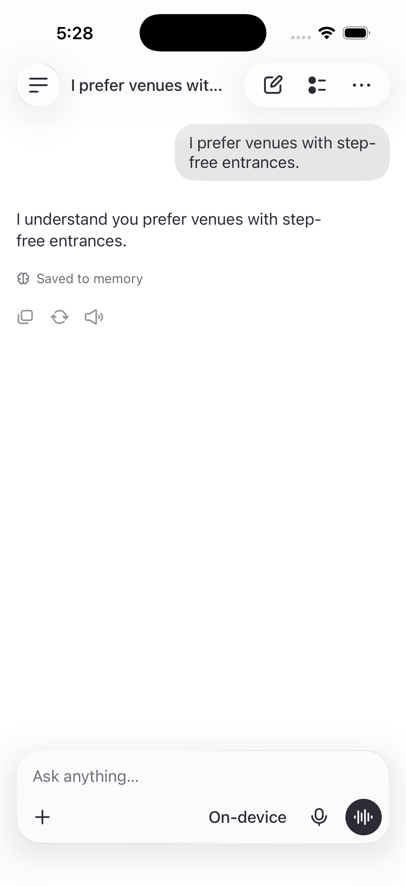
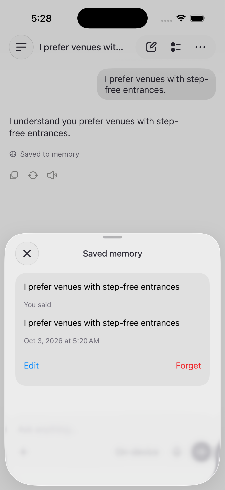
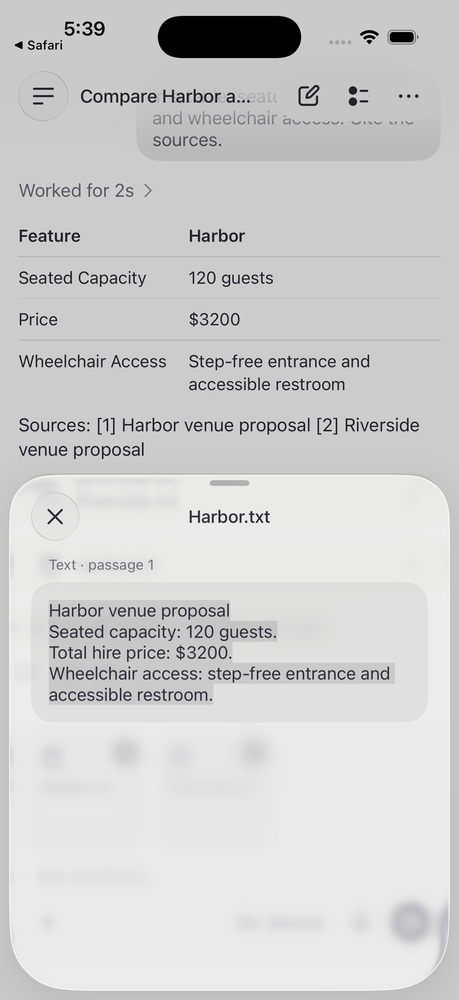
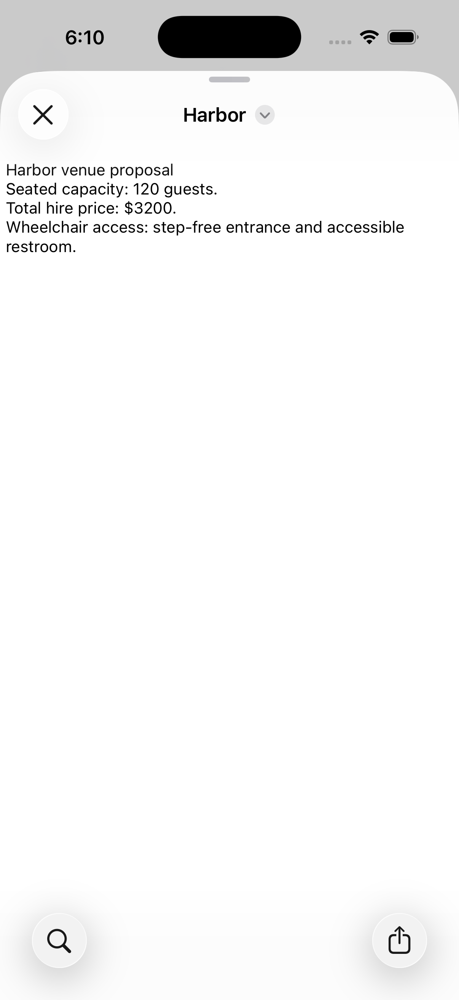
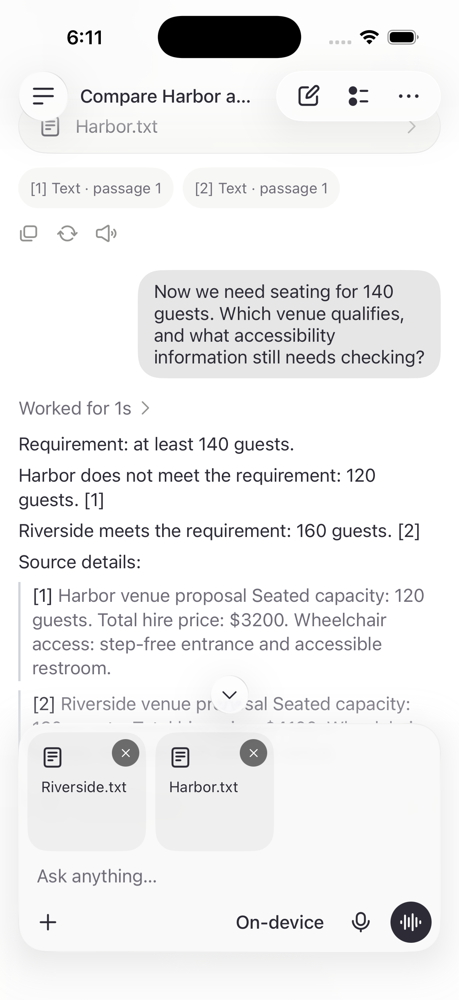
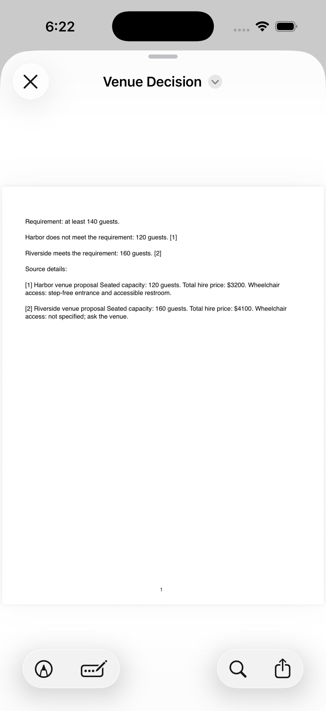

# Verification — 2026-10-03

## Environment

- Xcode 26.6; iOS 26.5 Simulator on macOS 26.5.1.
- Dedicated “Puma Workspace – UI” Simulator; normal live service configuration.
- The system language model was available and generated real responses. No fixture assistant was used in the opt-in live suite.
- No physical-device performance claim. Current Xcode 27 requires a Mac OS update on this machine; direct image-model integration remains deferred.

## Observed checks

| Check | Result |
| --- | --- |
| Default test scheme | 20 tests passed: stale saves, tombstones, interrupted replies, scoped search, memory commit/dedup/failure, verbatim evidence, CSV parser, PDF pagination, safe files, content-cache reuse, sandbox relocation including legacy URLs, OCR, generated-content indexing, question rejection, quote-validated numeric qualification, and voice/draft/playback-failure state transitions. |
| Real model: memory | Implicit quiet-venue and budget context extracted, saved, and recalled; no unsolicited output files. A mixed requirement/question saves the context and rejects the question. |
| Real model: comparison | Two imported proposals compared with source references; follow-up guest-count change identifies both venues and missing accessibility information. |
| Real model: files | Actual PDF, CSV, and R files created; PDF opens, CSV values parse, file contents exist. The source-report check also reads the PDF text and verifies the original capacity values and qualification, rather than only checking file existence. |
| Real model: graphics | Actual bar-chart and flow-diagram PNGs decode successfully. |
| Local recorded speech | Production audio conversion plus Whisper base transcribed “I prefer outdoor venues with quiet gardens.” correctly. |
| Recorded voice workflow | Recorded audio passes through real recognition, the shared voice controller, local model, memory commit/receipt, and actual synthesis callbacks; keyboard handoff returns to idle. This replaces the microphone source only. |
| Calculation and response shape | CSV arithmetic uses the calculation tool and returns its evidence. A simple preference receives a brief acknowledgment without a table or unsolicited file. |
| Simulator UI | Saved memory receipt opens the matching quote/date/edit/forget sheet; history and memory survive relaunch; a new chat recalls saved context. Files-picker imports, original-file preview after sandbox relocation, citation details, the verified 140-person revision, and its generated PDF were inspected in the live app. Forget removed the test record and reduced the Outputs count. |
| Release configuration | Generic Simulator Release build succeeded with live services. |

All nine live checks passed together in the final suite; all 20 deterministic checks and the generic Simulator Release build also passed. These are a small repeatable evaluation set, not a general model-quality guarantee. Test responses are attached to Xcode's result bundle.

## Sample Simulator timings

Earlier free-form-answer baseline (warm/downloaded assets, not a benchmark; the structured source-answer path below supersedes these document timings):

- Memory-backed answer: first text 0.61 s, complete 1.06 s.
- Two-source comparison: first text 0.65 s, complete 3.48 s.
- Revised requirement: first text 0.73 s, complete 3.57 s.
- Generated-file/image requests: complete approximately 1.97–2.97 s each.
- Recorded speech: complete 1.40 s for the short fixture.

The final source checks observed 3.29 s for the initial comparison, 0.21 s for the direct numeric revision, and 4.42 s for the verified PDF report. CSV calculation plus a structured answer has taken about 7.7–10.0 s. These are Simulator samples with active development work, not device performance targets.

Whisper model assets occupied approximately 149 MB after installation; tokenizer/support files are additional. First-use download time depends on connection and asset availability. No phone memory, battery, or thermal measurement has been made.

## Remaining checks and limits

- **Live microphone:** permissions, asset preparation, and recovery render, but the Simulator did not transcribe speech played through the Mac speakers. Recorded-audio inference passes. A real spoken microphone test remains pending; do not describe full voice conversation as verified end to end.
- **Offline:** the implementation has no remote inference/transcription path and caches required assets. A network-disconnected end-to-end run has not been observed. Do not confuse cached-model tests with verified offline operation.
- **Physical hardware:** camera capture, Bluetooth routing, interruption/resumption, latency, memory pressure, and thermal behavior need an iPhone pass.
- **Images:** Vision OCR reads image text. General scene reasoning and AI picture generation are not supported in this build.
- **Context:** recent history and memories are bounded; up to six selected sources per request. Retrieval is lexical FTS, not semantic embeddings. Long/complex documents can exceed the local model's budget and return an actionable error.
- **Evidence:** references must name retrieved passages. This validates provenance, not factual entailment; inspect the excerpt. A “Sources read” fallback explicitly signals when inline attribution was not produced.
- **Memory:** extraction is probabilistic. Stored context requires a verbatim user quote; edit/forget remain available. Forget removes the memory record, while original chat messages remain. Deleting a chat does not implicitly forget its already-saved global memories.
- **History:** conversation payloads currently load in full. Large-history pagination is future work.
- **Formats:** Office files require export to PDF/text/CSV. R files are not executed. Charts are bounded nonnegative bar charts and diagrams are ordered flows.
- **UI:** broad accessibility, large text, all device sizes, and complete light/dark regression checks remain beyond the observed Simulator pass.

## Reproduce

Use the commands in [README](../README.md). The default scheme does not require a model or network. `PumaWorkspaceLiveChecks` requires available Foundation Models and local speech assets; a missing system model skips its model-dependent cases with an explicit reason. The recorded-audio case tests speech separately and may acquire public assets on first use.

Run automated tests before manual Simulator inspection: Xcode intentionally relaunches the test host. For a manual pass, launch the app without `-preview`/`-uiState`, then follow the PRD demonstration. Turn off capture when finished.

## Simulator memory receipt

Synthetic venue-preference test, normal live services, after retry and relaunch. The receipt opens the exact saved quote and its controls.

 

## Source workflow regression

Importing the fictional [review inputs](demo/README.md) through the actual Files picker produced the expected initial comparison. Opening its citation showed the original Harbor passage below. The follow-up initially reused a source capacity as the user requirement; the original test only checked venue names and was too weak. The strengthened regression requires the new 140-person requirement, rejection of the smaller venue, and identification of the qualifying venue. Final source writing excludes previous generated answers and uses guided paragraphs/table cells. Numeric qualification is computed in Swift from quote-validated requirements and source values; the supporting passages remain visible. This addresses both stale conclusions and runaway free-form table formatting. These bounded checks do not establish general factual reliability.

The repaired live app reopened the imported original after installation changed its sandbox directory. Its revised answer rejects Harbor and qualifies Riverside using the quoted 140-person requirement.

 

The generated PDF was opened from the final reply and visually inspected. It preserves the 140-person requirement, Harbor’s 120-person capacity and $3200 price, Riverside’s 160-person capacity and $4100 price, and the unspecified accessibility information.

